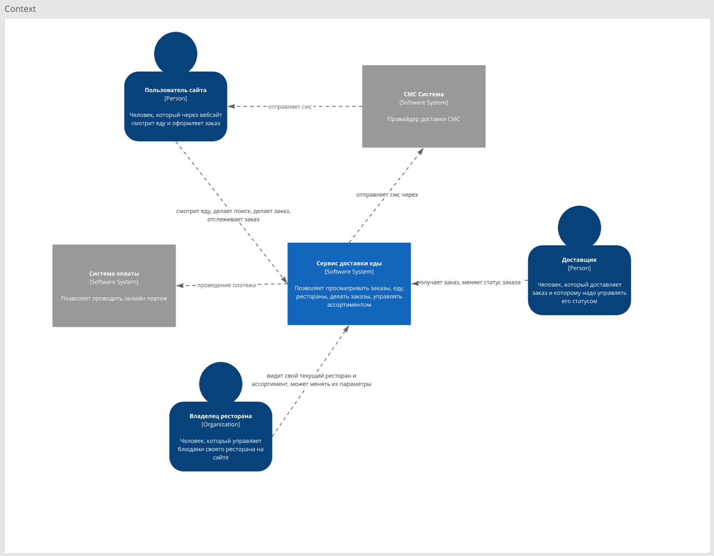
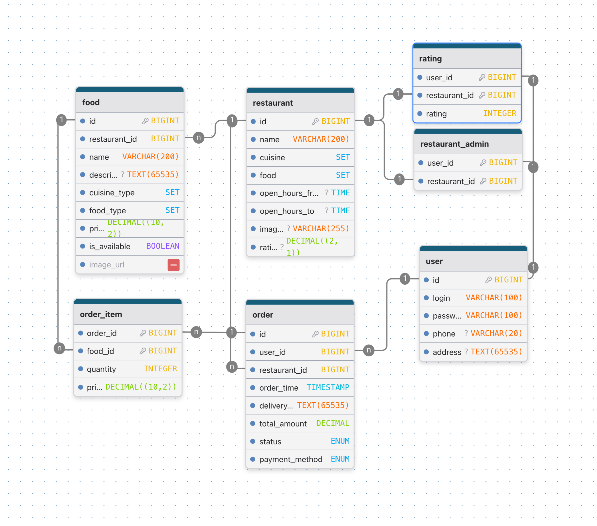

# Архитектурный стиль
Система спроектирована в виде гибрида между микросервисной архитектурой (MSA) и service-based (SBA). Компоненты системы:
- order service - отвечает за просмотр ресторанов, меню, создание заказов и оплата. Любое взаимодействие с обычными клиентами происходит через него. Использует `postgresql db 1`, `s3`, `message broker`. Основная нагрузка проходит через него. С другими сервисами взаимодействует приоритетно через асинхронные методы или через бд. Python, fastapi.
- api service - отвечает за просмотр параметров ресторана и их изменение, также позволяет создавать курьеров. Предназначен только для администраторов ресторанов. Взаимодействие приоритетно через api без интерфейса. Использует `postgresql db 1`, `s3`, `tracking service`. Отделен, чтобы разграничить поддержку web части и чтобы отделить от основной нагрузки - лучше и этому сервису, так и `order service`. Общая бд с `order service`, чтобы использовать общих пользователей и иметь консистентную информацию о пользователях и ресторанах. Запросы приоритетно синхронны, чтобы возращать по api финальный результат операции. Python, fastapi.
- tracking service - отвечает за получение заказов и изменение их статуса в процессе доставки. Предназначен только для доставщиков. Взаимодействие приоритетно через api без интерфейса. Использует `postgresql db 2`. Отделен, чтобы разграничить поддержку web части и чтобы отделить от основной нагрузки - лучше и этому сервису, так и `order service`. Использует отдельную бд `postgresql db 2`, чтобы хранить только малую часть заказов, которые сейчас нужны сервису - поможет и производительности запросов сервиса, так и не будет нагружать основную базу, также хранение курьеров тут разграничит их от обычных пользователей. Общение с `order service` через брокер сообщений, чтобы быть более устойчивым к отказу основного сервиса, в условиях когда не нужно немедленное обновление информации о статусе у пользователя. Python, fastapi.
- postgresql db 1 - основная база данных. Для `order service`, `api service`.
- postgresql db 2 - вторичная база данных с большой текучкой данных. Для `tracking service`.
- s3 - хранение медиафайлов (фотографии еды и ресторанов). Более масштабируемо по сравнению с network file system (NFS) и позволяет интегрироваться с DNS. Также снимает нагрузку хранения файлов с реляционной бд.
- message broker - брокер сообщений для асинхронного взаимодействия. Проще в реализации, производительнее и надежнее чем методы polling/webhooks. Rabbit MQ для экономии ресурсов и в условиях небольшого количества топиков.

# Компоненты
C4 первого и второго уровня системы.

Первый уровень

Второй уровень - обращаться к легенде, больше деталей по некоторым взаимодействиям в sequence diagrams


# Sequence diagrams
Взаимодействия сервисов, включая внешние системы и пользователя, в виде **draw.io** диаграмм.

Sequence 1 - сценарий просмотра каталога, обычное и самое частое действие пользователя.


Sequence 2 - сценарий создания заказа, в нем важен быстрый ответ и надежность обработки платежа. Включает, что делать если брокер сообщений не доступен (статус заказа не меняется из-за чего отправка повторится позже).


Sequence 3 - сценарий обновления статуса заказа на стороне курьера. Включает асинхронное взаимодействие от вторичного сервиса к основному.


# API
Версионирование через путь в запросах (v1/v2/...). Поддерживается только для api запросов в `api service` и `tracking service`. Для `order service` поддерживаемый метод взаиможействия только через web - изменения будут либо обратно совместимыми или временно поддерживаться старые ручки (или набор полей) для перехода в два релиза на новые.

1. Обновления статуса курьером
```
PATCH /api/v1/order/{order_id}?status={status}
Описание: Курьер обновляет статус заказа на status.

Request:
  order_id — id заказа, который надо обновить
  status — на какой статус поменять статус заказа. Возможные значения: "confirmed", "preparing", "delivery", "finished", "cancelled"
  без тела

Response 200:
  {
    "order_id": long, (must be as in uri)
    "status": string, (status after update, expected to be as in query parameter)
    "updated_at": string (timestamp in UTC)
  }

Errors:
  400 — параметр status отсутствует или имеет недопустимое значение
  401 — не аутентифицирован (требуется вход курьера)
  403 — курьер не назначен на данный заказ
  404 — заказ с указанным order_id не найден
  409 — переход в статус "delivery" невозможен из текущего статуса заказа
  503 — сервис временно недоступен
```
2. Создание заказа
```
POST /order?key={idempotency_key}
Описание: Пользователь создаёт заказ. Параметр key (UUID) используется для идемпотентности — повторные запросы с тем же key не создают новый заказ, а возвращают уже существующий.

Request body:
{
  "items": [
    {"food_id": 123456789, "quantity": 2},
    {"food_id": 987654321, "quantity": 1}
  ],
  "restaurant_id": 123456789,
  "payment_method": "online" ("online", "offline")
}

Response 201:
{
  "order_id": 12345678987,
  "status": "in_payment",
  "total_amount": 999.99,
  "order_time": "2026-04-21T15:00:00Z"
}

Errors:
  400 — невалидный JSON или недопустимая структура / значения
  404 — один или несколько food_id не найдены
  409 — конфликт: key уже использован для другого заказа (разные body при одинаковом key)
  503 — сервис временно недоступен
```
3. Получения фильтрованного списка ресторанов
```
GET /restaurant/list?page={page}&query={query}&limit={limit}
Описание: Получение списка ресторанов с пагинацией и фильтрацией. Сортировка всегда по id (по возрастанию).

Request:
  page — номер страницы (начиная с 1)
  query — строка для фильтрации по типу кухни (cuisine) или типу еды (food) по правилу **или**. Пример структуры query: "cuisine:italian,japanese;food:pizza,sushi" - блоки cuisine/food опциональны
  limit — сколько отдать ресторанов максимум, используется для определения страницы в том числе
  нет тела

Response 200:
{
  "page": 1,
  "limit": 10,
  "items_count": 2,
  "items": [
    {
      "id": 1,
      "name": "Итальянская пиццерия",
      "cuisine": ["italian", "european"],
      "food": ["pizza", "pasta"],
      "opening_hours": {
        "open": "10:00",
        "close": "23:00"
      },
      "image_url": "https://example.com/photo1.jpg",
      "rating": 4.5
    },
    {
      "id": 2,
      "name": "Суши-бар",
      "cuisine": ["japanese"],
      "food": ["sushi", "rolls"],
      "opening_hours": {
        "open": "11:00",
        "close": "22:00"
      },
      "image_url": "https://example.com/photo2.jpg",
      "rating": 4.7
    }
  ]
}

Errors:
  400 — недопустимые значения параметров запроса
  503 — сервис временно недоступен
```

# БД и модели данных
Обоснование выбора бд смотреть в ADR.

Кратко: для бд с данными выбран PostgreSQL из-за устойчивой структуры объектов и необходимости как сильных гарантий на содержание (уникальность, значение), так и фильтрации по полям. S3 для хранение медиафайлов, потому что реляционная бд реградирует от больших кусков в полях, а файловая система ограничена по масштабированию.

## БД 1

### Декларация
```
-- ============================================
-- Types
-- ============================================
CREATE TYPE cuisine_types AS ENUM (
    'Italian',
    'Chinese',
    'Japanese',
    'Mexican',
    'Indian',
    'French',
    'Thai',
    'Mediterranean',
    'American',
    'Greek'
);
CREATE TYPE food_types AS ENUM (
    'Pizza',
    'Burger',
    'Sushi',
    'Tea',
    'Sweet drink',
    'Extra',
    'Souce'
);
CREATE TYPE time_range AS (
    beginning time,
    ending time
);
CREATE TYPE order_statuses AS (
 'in_payment' - created and awaiting payment online
 'created', -- created and already payed if online or was created with offline payment
 'pending', -- 'created' and published to broker
 'confirmed', -- taken by courier
 'preparing', -- being assembled
 'delivery', -- being delivered
 'finished', -- delivered and money taken if offline
 'cancelled' -- in case is canceled by courier of user
);
CREATE TYPE payment_methods AS (
 'online',
 'offline'
);

-- ============================================
-- Table: "user"(customers and restaurant admins)
-- ============================================
CREATE TABLE IF NOT EXISTS "user" (
    id         BIGINT GENERATED ALWAYS AS IDENTITY PRIMARY KEY,
    login      VARCHAR(100) NOT NULL UNIQUE,
    password   VARCHAR(100) NOT NULL,
    phone      VARCHAR(20),
    address    TEXT
);

-- ============================================
-- Table: restaurant
-- ============================================
CREATE TABLE IF NOT EXISTS restaurant (
    id            BIGINT GENERATED ALWAYS AS IDENTITY PRIMARY KEY,
    name          VARCHAR(200) NOT NULL,
    cuisine       cuisine_types[] NOT NULL,
    food    food_types[] NOT NULL,
    opening_hours time_range,
    image_url   TEXT,
 rating  DECIMAL(2,1) CHECK (rating >= 0)
);

-- ============================================
-- Table: restaurant_admin
-- ============================================
CREATE TABLE IF NOT EXISTS restaurant_admin (
    user_id       BIGINT NOT NULL REFERENCES "user"(id) ON DELETE CASCADE,
    restaurant_id BIGINT NOT NULL REFERENCES restaurant(id) ON DELETE CASCADE,
    PRIMARY KEY(user_id, restaurant_id)
);
CREATE INDEX IF NOT EXISTS idx_restaurant_admin_restaurant_id ON restaurant_admin (restaurant_id);

-- ============================================
-- Table: food
-- ============================================
CREATE TABLE IF NOT EXISTS food (
    id            BIGINT GENERATED ALWAYS AS IDENTITY PRIMARY KEY,
    restaurant_id BIGINT NOT NULL REFERENCES restaurant(id) ON DELETE CASCADE,
    name          VARCHAR(200) NOT NULL,
    description   TEXT,
    cuisine_type  cuisine_types NOT NULL,
    food_type   food_types NOT NULL,
    price         DECIMAL(10,2) NOT NULL CHECK (price >= 0), -- in rubles
    is_available  BOOLEAN DEFAULT TRUE,
    image_url     TEXT
);
CREATE INDEX IF NOT EXISTS idx_food_restaurant_id ON food (restaurant_id);

-- ============================================
-- Table: "order"
-- ============================================
CREATE TABLE IF NOT EXISTS "order" (
    id                BIGINT GENERATED ALWAYS AS IDENTITY PRIMARY KEY,
 creation_key  UUID UNIQUE,
    user_id           BIGINT REFERENCES "user"(id) ON DELETE SET NULL,
    restaurant_id     BIGINT NOT NULL REFERENCES restaurant(id) ON DELETE RESTRICT,
    order_time        TIMESTAMPTZ NOT NULL DEFAULT now(),
    delivery_address  TEXT NOT NULL,
    total_amount      DECIMAL(10,2) NOT NULL CHECK (total_amount >= 0),
    status            order_status NOT NULL,
    payment_method    payment_methods NOT NULL
);
CREATE INDEX IF NOT EXISTS idx_order_user_id_status ON "order" (user_id, status);

-- ============================================
-- Table: order_item
-- ============================================
CREATE TABLE IF NOT EXISTS order_item (
    order_id        BIGINT NOT NULL REFERENCES "order"(id) ON DELETE CASCADE,
    food_id         BIGINT NOT NULL REFERENCES food(id) ON DELETE RESTRICT,
    quantity        INTEGER NOT NULL CHECK (quantity > 0),
    price_at_time   DECIMAL(10,2) NOT NULL CHECK (price_at_time >= 0),
    PRIMARY KEY(order_id, food_id)
);

-- ============================================
-- Table: rating
-- ============================================
CREATE TABLE IF NOT EXISTS rating (
    user_id        BIGINT NOT NULL REFERENCES "order"(id) ON DELETE CASCADE,
    restaurant_id     BIGINT NOT NULL REFERENCES restaurant(id) ON DELETE CASCADE,
    rating  INTEGER NOT NULL CHECK (rating > 0),
    PRIMARY KEY(user_id, restaurant_id)
);
```


### Индексы
- idx_restaurant_admin_restaurant_id - чтобы искать админов ресторана, может понадобиться, хотя в основном  PRIMARY KEY(user_id, restaurant_id) будет использоваться (поиск по user_id)
- idx_food_restaurant_id - чтобы искать еду, которая принадлежит конкретному ресторану
- idx_order_user_id_status - чтобы находить заказы пользователя (когда он хочет их просмотреть) и также поиск по типу, потому что со временем селективность по ним может вырасти (очень много завершенных заказов)
- по food_types и cuisine_types индексов нет, потому что не ожидается большая селективность
- некоторые другие индексы нужны, но не описаны тут, потому что автоматически создаются, как часть unique или primary key ограничений

## БД 2

### Декларация
```
-- ============================================
-- Types
-- ============================================
CREATE TYPE order_statuses AS (
 'pending', -- created and payed if online
 'confirmed', -- taken by courier
 'preparing', -- being assembled
 'delivery', -- being delivered
 'finished', -- delivered and money taken if offline
 'cancelled' -- in case is canceled by courier of user
);
CREATE TYPE payment_methods AS (
 'online',
 'offline'
);

-- ============================================
-- Table: courier
-- ============================================
CREATE TABLE IF NOT EXISTS courier (
    id           BIGINT GENERATED ALWAYS AS IDENTITY PRIMARY KEY,
    restaurant_id   BIGINT NOT NULL,
    password     VARCHAR(100) NOT NULL
);
CREATE INDEX IF NOT EXISTS idx_courier_restaurant_id ON courier (restaurant_id);

-- ============================================
-- Table: "order"
-- ============================================
CREATE TABLE IF NOT EXISTS "order" (
    id                BIGINT PRIMARY KEY,
    restaurant_id     BIGINT NOT NULL,
    courier_id        BIGINT REFERENCES courier(id) ON DELETE RESTRICT,
    order_time        TIMESTAMPTZ NOT NULL,
    delivery_address  TEXT NOT NULL,
 phone      VARCHAR(20),
    total_amount      DECIMAL(10,2) NOT NULL CHECK (total_amount >= 0),
    status            order_status NOT NULL,
    payment_method    payment_methods NOT NULL,
    content     JSONB NOT NULL -- full content of order with id, name, quantity
);
CREATE INDEX IF NOT EXISTS idx_order_courier_id ON "order" (courier_id);
CREATE INDEX IF NOT EXISTS idx_order_restaurant_id_status ON "order" (restaurant_id, status);
```

### Индексы
- idx_courier_restaurant_id - чтобы находить курьеров конкретного ресторана
- idx_order_courier_id - чтобы находить текущие заказы курьера
- idx_order_restaurant_id_status - чтобы находить заказы ресторана, которые нужно взять и просто отслеживать их статус
- некоторые другие индексы нужны, но не описаны тут, потому что автоматически создаются, как часть unique или primary key ограничений

# ADR
Смотреть [adr.md](https://github.com/Tefaier/HighLoadHW/blob/main/docs/adr.md)
